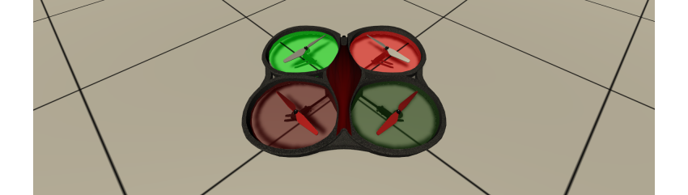
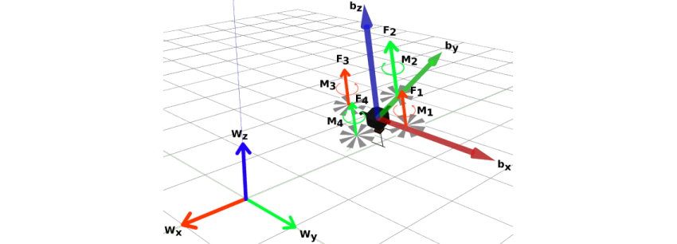
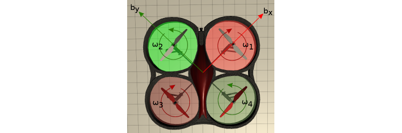
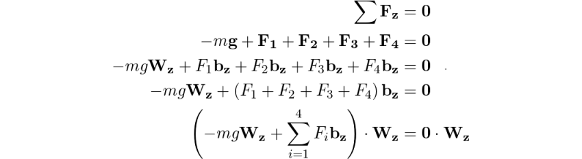
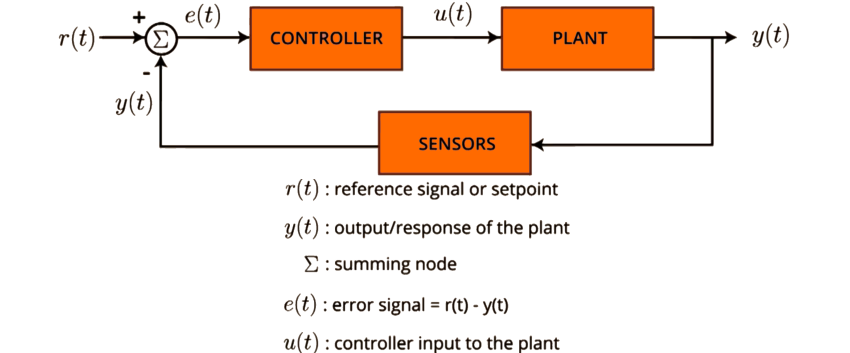
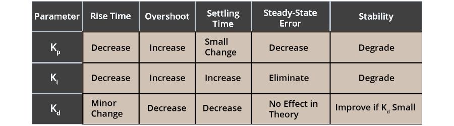
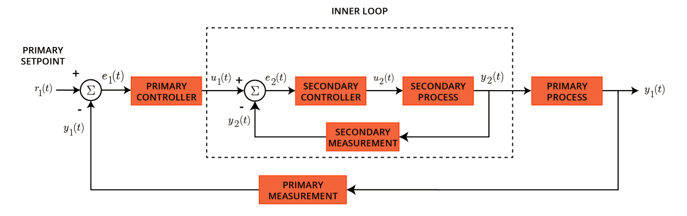
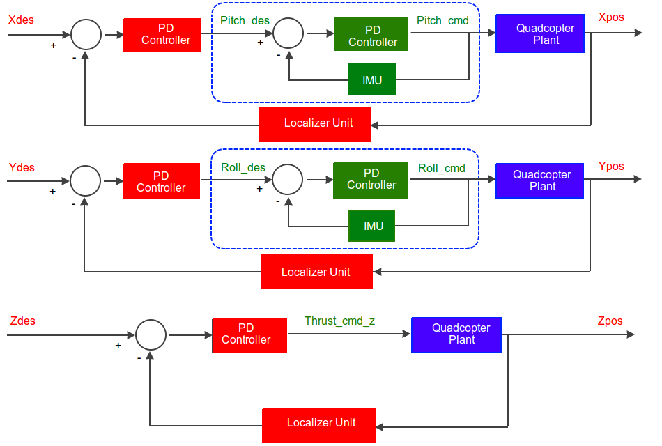

# Project: Controls Lab

## 1. Project Summary
The goal of the project is to learn the fundamentals and implement a PID controller on a quadcopter.

This PID controller will be used in a ROS node for controlling the hover, attitude, and position of a quadcopter inside a Unity simulation environment.

**Objectives:**
* Implement a PID Controller
* Implement a Hover Controller
* Implement a Attitude Controller
* Implement a Position Controller

## 2. Quadcopter Kinematics
To explore the kinematics of a quadcopter, there are two reference frames considered - **world frame** and **body frame**. The **world frame** is a fixed frame unlike the **body frame** whose origin is coincident with the _center of mass_ of the quadcopter.

* **Wx**, **Wy**, **Wz** are the orthonormal vectors of the world frame. **bx**, **by**, **bz** are the orthonormal vectors of the body frame (or quadcopter).
* Thrusts generated by each rotor is labeled by **Fi**. The torque generated by each propeller is labeled by **Mi**.

A point **P** seen from the **body frame** can be represented in the **world frame** using a composite rotation matrix intrinsically formed i.e. WRB = Rz(yaw) * Ry(pitch) * Rx(roll)

#### 2.1 Quadcopter Motion
A rigid body in 3D space has six degrees of freedom. However, a quadrotor only has four motors to act as control inputs, thus a quadrotor is an example of an underactuated system. What this means is that a quadrotor cannot independently control each translational and rotational degree of freedom.

* **Pitch**: To translate the quadcopter forward/backward, we need to pitch the quadcopter along the y-axis of the body frame.
  Rotation by a positive pitch angle along **by**, translates it forward.
  Rotation by a negative pitch angle along **by**, translates it backward.

* **Roll**: To translate the quadcopter right/left, we need to roll the quadcopter along the x-axis of the body frame.
  Rotation by a positive roll angle along **bx**, translates it right.
  Rotation by a negative roll angle along **bx**, translates it left.

* **Vertical Motion**: Each rotor produces a thrust that is proportional to the angular velocity of the rotor. If the net motor thrust along the z-axis of the body frame is greater than the force of gravity, then the quadrotor will accelerate upwards. The converse holds true as well.

* **Yaw**: Motors 1 & 3 rotate clockwise; Motors 2 & 4 rotate counter-clockwise. Since torque produced is opposite to the direction of the propeller, torque from motors 1 & 3 rotate counter-clockwise while torque from motors 2 & 4 rotate clockwise. For a pure yawing motion, i.e., rotate without changing elevation, one pair of motors would increase their angular speeds by the same amount as the opposite pair would decrease theirs.

#### 2.2 Quadcopter States
In general, a quadrotor requires 12 generalized coordinates to completely describe its position and orientation in 3D space (3 for position, 3 for orientation, and their time derivatives).

* `x`, `y`, `z` - Position of the quadrotor’s center of mass.
* `ϕ`, `θ`, `ψ` - Orientation, in Euler angles, of {B} relative to {W}.​
* `x_dot`, `y_dot`, `z_dot`​ - Linear velocities of the quadrotor’s center of mass.​
* `ϕ_dot`, `θ_dot`, `​ψ_dot` - Angular velocities of {B} relative to {W}.

#### 2.3 Calculating angular velocity at Hover
Calculating the nominal motor thrust to hover in an equilibrium configuration is very straightforward - it is simply a statics problem. If the sum of the forces acting in the **Wz** direction is equal to zero, then there is no acceleration in the z-direction of the world frame.

In equilibrium state, each motor thrust is the same, and the z-axis of {B} and {W} frames are parallel, hence their dot product is 1.

## 3. PID Controller
In a closed-loop system, the objective is to track a desired set point by minimizing the error. The error is the difference between the desired set point and current measurement.

The Proportional-Integral-Derivative (PID) controller is the most ubiquitous controller used in the industry with over 97% systems having some form of PID within then.

PID is the **Controller** block in the figure above. It generates _**u(t)**_ (control effort) based on _**e(t)**_ (error) and feeds it to the **Plant** block. The plant produces the _**y(t)**_ (output).  The **Sensor** block senses the output and feeds it back to the **summing** node for re-calculating the error.

#### 3.1 Parameter Definitions
* **Proportional** - The error is multiplied by a constant called proportional parameter (Kp) creating a control effort proportional to the error.

* **Integral** - The error is integrated and then multiplied by a constant called integral parameter (Ki) creating a control effort that keeps track of error's history.

* **Derivative** - The derivative of the error is computed for every time internal. The differential error is multiplied by a constant called derivative parameter (Kd) creating a control effort that can predict the error.

#### 3.2 Parameter Effects
Changing the parameters Kp, Ki, Kd alters the behavior of the control effort, _**u(t)**_, generated by the PID controller drastically. The table below summarizes the behavior of the control effort generated by the PID.

* **Rise time** - Time taken to first reach the desired value.
* **Overshoot** - The maximum offset from the desired value.
* **Settling time** - Time taken to get within 95-98% of desired value.
* **Steady-state error** - Difference between desired value and steady-state value.
* **Stability** - Ability to track the desired set point with negligible oscillations.

## 4. Positional Control of Quadcopter
The goal is to navigate a quadcopter stably to a desired position in 3D space. First, the quadcopter will need to achieve a stable hovering altitude with the help of the **Hover Controller**. After getting a stable hover, next the attitude of the quadcopter will be made stable using the **Attitude Controller**. Finally, within a cascaded fashion, the **Position Controller** will be implemented.

#### 4.1 Hover Controller
The hover controller is responsible for making the quadcopter hover stably at a desired altitude. I used a PD controller with the following parameters:
* **Hover:**
  - Kp - 10.0
  - Ki - 0.0
  - Kd - 10.0
* **Gravity** - On

#### 4.2 Attitude Controller
The attitude controller is responsible for maintaining the pose of the quadcopter at the desired orientation. Here too, I used a PD controller with the following parameters:
* **Roll:**
  - Kp - 2.0
  - Ki - 0.0
  - Kd - 2.0
* **Pitch:**
  - Kp - 2.0
  - Ki - 0.0
  - Kd - 2.0
* **Yaw:**
  - Kp - 5.0
  - Ki - 0.0
  - Kd - 5.0
* **Gravity** - On

#### 4.3 Cascaded Control
The cascade control is simply a closed-loop system within another closed-loop system. It can be thought of a loop within a loop. The general principle is for the inner loop to operate at a frequency at least 10x times faster than the outer loop.

For our position controller, the inner loop is the **Attitude Controller** while the **Position Controller** is the outer loop.

#### 4.4 Position Controller

The position controller is responsible for translating the quadcopter to a desired position. I used a PD controller for **Xdes**, **Ydes**, and **Zdes**. The controller for **Zdes** is just the hover controller implemented above. I used a PD controller with the following parameters:
* **Xdes:**
  - Kp - 0.75
  - Ki - 0.00
  - Kd - 1.50
* **Ydes:**
  - Kp - 0.75
  - Ki - 0.00
  - Kd - 1.50
* **Zdes (Hover):**
  - Kp - 10.0
  - Ki - 0.0
  - Kd - 10.0
* **Gravity** - On
