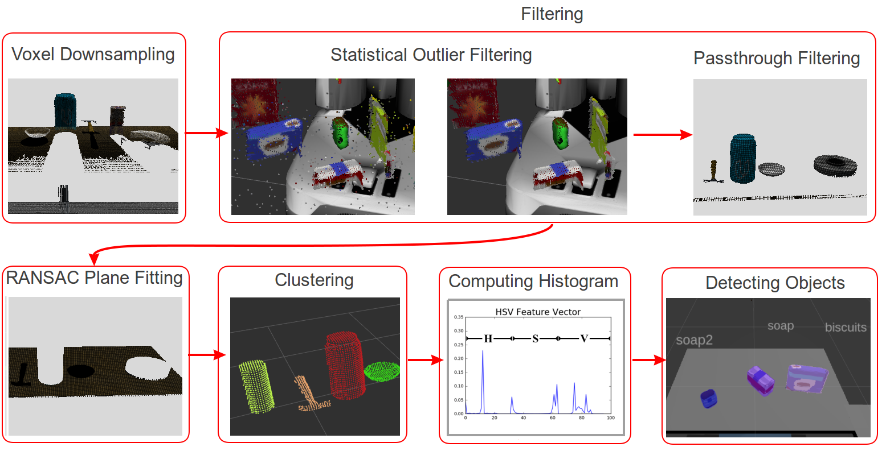
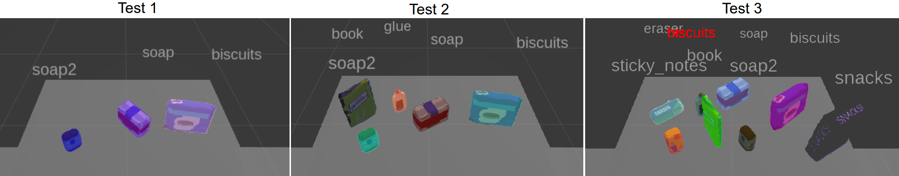
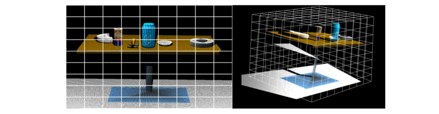
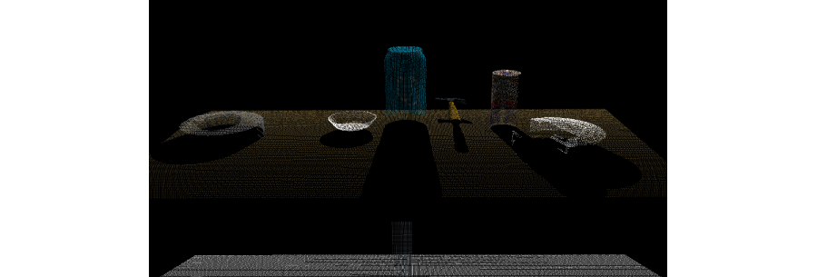
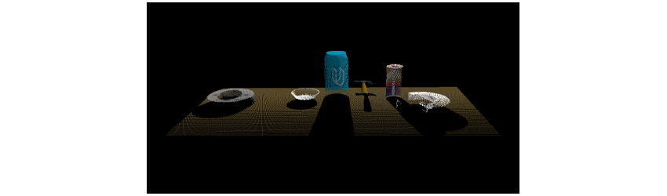
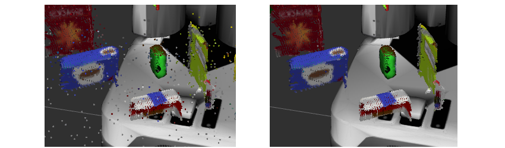
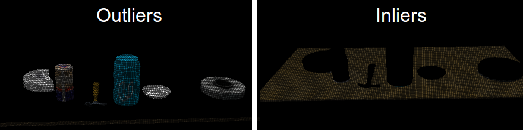
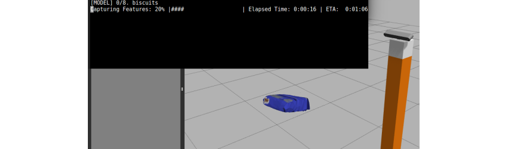
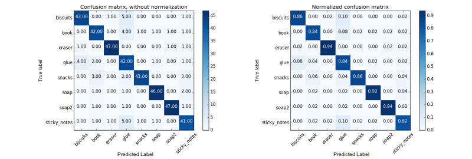

# Project 3: Perception Project


## 1. Project Summary
The goal of the project is to detect a set of objects through the help of a perception pipeline and machine learning. The objects are represented as point clouds (an abstract data type) that contains information on the object's position, color, and/or intensity.

Through a series of techniques such as filtering, clustering for segmenting, and machine learning methods, we are able to detect the objects.

<!--  -->


### 1.1 Objectives:
* Implement a perception pipeline
* Train the classifier to detect objects
* Detect different objects in 3 testing worlds
*
### 1.2 Outcomes:
* 3/3 objects detected in World 1
* 5/5 objects detected in World 2
* 7/8 objects detected in World 3
<!-- * Click on the image below to view the demo on YouTube. (<https://www.youtube.com/watch?v=1BXRThDDH1Q>) -->



## 2. Sampling, Filtering, and Plane Fitting
The objects in the environment are detected with the help of an RGB-D (red, green, blue - depth) camera. The data type representing an object is in the form of point clouds.

Point clouds need to be manipulated in order to remove noise, decrease computational complexity, and/or increase feature extraction.

### 2.1 Voxel Sampling Point Clouds
Voxel stands for "volume element". The 3D point cloud can be divided into a regular 3D grid (right-image) of volume elements, similar to a 2D image divided into grids (left-image). Each individual cell in the grid is now a voxel and the 3D grid is known as a "voxel grid". The size of an individual voxel is also called **leaf size**.


A voxel grid filter allows you to downsample the data (along any dimension) by taking a spatial average of the points in the cloud confined within a voxel. The set of points which lie within the bounds of a voxel are assigned to that voxel and statistically combined into one output point. The point clouds are downsampled using a **leaf size** of `0.005`.



```python
# Samples the point cloud using the LEAF size
def voxel_sample(pcloud, leaf=0.005):
    # Voxel Grid Downsampling
    vox         = pcloud.make_voxel_grid_filter()
    leaf_size   = leaf   # leaf/voxel (volume-element) size
    vox.set_leaf_size(leaf_size, leaf_size, leaf_size)
    return vox.filter()  # voxel downsampled point cloud

# Voxel Grid Downsampling
pcl_voxed   = voxel_sample(pcl_cloud)
```

### 2.2 Filtering Point Clouds
Filtering allows to remove regions in our point cloud that we are otherwise not interested in. This could imply removing areas of point cloud that are useless to us or even removing noise which is essential for robust detection.

There are two filters implemented in the project. They are **Pass-through** and **Statistical Outlier** filtering techniques.

* **Pass-through Filtering**: Having prior knowledge of the objects we are interested in, there may be regions we are not interested in and want to crop out. The pass-through filter is akin to a cropping tool, where we remove 3D point cloud along a certain dimension by specifying a minimum and maximum limit along that dimension. The region that we let _pass through_ is the called the **_region of interest_**. Only the objects on top of the table are of interest to us, hence we let the table top and the objects pass through.

  

  ```python
  # Filters the point cloud along a certain axis between min and max limits
  def passthrough_filter(pcloud, axis='z', axis_min=0.6, axis_max=1.2):
      passthrough = pcloud.make_passthrough_filter()
      passthrough.set_filter_field_name(axis)
      passthrough.set_filter_limits(axis_min, axis_max)
      return passthrough.filter()

  # PassThrough Filter
  pcl_passed  = passthrough_filter(pcl_voxed, axis='z', axis_min=0.6, axis_max=1.2)
  pcl_passed  = passthrough_filter(pcl_passed,axis='x', axis_min=0.3, axis_max=1.0)
  ```

* **Statistical Outlier Filtering**: Due to the possibility of noise in our point cloud data, we need to remove the noise since it may lead to sparse outliers thereby corrupting the results. One of the techniques used to remove such outliers is to perform a statistical analysis in the neighborhood of each point. Then remove those points which do not meet a certain criteria. For each point in the point cloud, it computes the distance to all of its neighbors, and then calculates a mean distance.

  

  ```python
  # Filter out outliers using statistical outlier filtering.
  # k_mean    --> number of neighboring points to analyze
  # threshold --> scale factor
  def statistical_filter(pcloud, k_mean=10, threshold=0.003):
      outlier_filter = pcloud.make_statistical_outlier_filter()
      outlier_filter.set_mean_k(k_mean)
      outlier_filter.set_std_dev_mul_thresh(threshold)
      return outlier_filter.filter()

  # Statistical Outlier Filtering
  pcl_cloud    = statistical_filter(pcl_cloud)
  ```

### 2.3 Plane Fitting of Point Clouds
Now we have the both the table top and objects atop the table. Since we are only interested in the objects, we want to remove the table. We will do this by plane fitting points that correspond to the table. A very popular method called the **Random Sample Consensus** (RANSAC) is used for identifying points belonging to table.

We extract two pieces of information - **inliers** and **outliers**. The inliers are all points corresponding to the table while the outliers correspond to the table placed on the table. We are interested in the outliers.



```python
# RANSAC plane fitting to find inliers within a certain distance
def segment_ransac(pcloud, max_dist = 0.01):
    seg_ransac  = pcloud.make_segmenter()
    seg_ransac.set_model_type(pcl.SACMODEL_PLANE)
    seg_ransac.set_method_type(pcl.SAC_RANSAC)
    seg_ransac.set_distance_threshold(max_dist)
    return seg_ransac.segment()

# RANSAC Plane Segmentation
inliers, coefficients = segment_ransac(pcl_passed) # Extract inliers

outlier_objects = pcl_passed.extract(inliers, negative=True)
inlier_table    = pcl_passed.extract(inliers, negative=False)
```

## 3 Clustering for Segmentation
Now that we have our objects on the table (retrieved as outliers from the RANSAC plane-fitting step), we need to cluster the point clouds associated with each object. After clustering we will segment out each object to be later trained by our classifier for object detection.

We implemented the clustering algortithm with the help of Euclidean Clustering technique. First we convert the point cloud's XYZRGB data type to just XYZ data type. Then we cluster each point cloud through a series of parameters - `tolerance`, `minimum` and `maximum` cluster sizes.


```python
def euclidean_cluster(pcloud, tol=0.01, min_size=75, max_size=12000):
    tree    = pcloud.make_kdtree()
    ec      = pcloud.make_EuclideanClusterExtraction()
    ec.set_ClusterTolerance(tol)
    ec.set_MinClusterSize(min_size)
    ec.set_MaxClusterSize(max_size)
    ec.set_SearchMethod(tree)   #Search k-d tree for clusters
    return ec.Extract()  #Indices for each clusters

def color_cluster(pcloud, cluster_indices):
    # Create Cluster-Mask Point Cloud to see each cluster
    cluster_color = get_color_list(len(cluster_indices))

    color_cluster_point_list = []

    for j, indices in enumerate(cluster_indices):
        for i, index in enumerate(indices):
            color_cluster_point_list.append([
                pcloud[index][0],
                pcloud[index][1],
                pcloud[index][2],
                rgb_to_float(cluster_color[j])
                ])

    #Create new cloud with all clusters, each with unique color
    cluster_cloud = pcl.PointCloud_PointXYZRGB()
    cluster_cloud.from_list(color_cluster_point_list)
    return cluster_cloud

# Euclidean Clustering
white_cloud = XYZRGB_to_XYZ(outlier_objects)
cluster_indices = euclidean_cluster(white_cloud)  #Indices for each object cluster on the table

# Color each individual cluster
cluster_cloud   = color_cluster(white_cloud, cluster_indices)
```

## 4. Object Detection
After clustering and segmenting out each individual object, we need to detect the object. Object detection is a fairly complex problem. Typically, features such as shape, color, and/or texture are used to determine an object. These features are then passed on to a classifier that trains and tests the data.

### 4.1 Color Space and Surface Normals
The **HSV** color model, which stands for Hue-Saturation-Value, is preferred over the standard **RGB** model for extracting color histograms. Since different objects can share the same color, we also use the surface normal of the object to distinguish an object from another further. We extract the histogram of these surface normals as well.

```python
def compute_color_histograms(cloud, using_hsv=False):

    # Compute histograms for the clusters
    point_colors_list = []

    # Step through each point in the point cloud
    for point in pc2.read_points(cloud, skip_nans=True):
        rgb_list = float_to_rgb(point[3])
        if using_hsv:
            point_colors_list.append(rgb_to_hsv(rgb_list) * 255)
        else:
            point_colors_list.append(rgb_list)

    # Populate lists with color values
    channel_1_vals = []
    channel_2_vals = []
    channel_3_vals = []

    for color in point_colors_list:
        channel_1_vals.append(color[0])
        channel_2_vals.append(color[1])
        channel_3_vals.append(color[2])

    nbin = 32
    c1 = np.histogram(channel_1_vals, bins=nbin, range=(0,256))
    c2 = np.histogram(channel_2_vals, bins=nbin, range=(0,256))
    c3 = np.histogram(channel_3_vals, bins=nbin, range=(0,256))

    # Concatenate the histograms into a single feature vector
    ch_features = np.concatenate((c1[0], c2[0], c3[0])).astype(np.float64)

    # Normalize the result
    norm_features = ch_features / np.sum(ch_features)
    return norm_features

def compute_normal_histograms(normal_cloud):
    norm_x_vals = []
    norm_y_vals = []
    norm_z_vals = []

    for norm_component in pc2.read_points(normal_cloud,
                                          field_names = ('normal_x', 'normal_y', 'normal_z'),
                                          skip_nans=True):
        norm_x_vals.append(norm_component[0])
        norm_y_vals.append(norm_component[1])
        norm_z_vals.append(norm_component[2])

    nbin = 32
    n1 = np.histogram(norm_x_vals, bins=nbin, range=(0,256))
    n2 = np.histogram(norm_y_vals, bins=nbin, range=(0,256))
    n3 = np.histogram(norm_z_vals, bins=nbin, range=(0,256))

    # Concatenate the histograms into a single feature vector
    n_features = np.concatenate((n1[0], n2[0], n3[0])).astype(np.float64)

    # Normalize the result
    norm_features = n_features / np.sum(n_features)

    return norm_features
```

### 4.2 Support Vector Machines
From the histograms generated using **HSV** color space and surface normals, we will first store all these features as the training set for our classifier. We use a supervised machine learning classifier called the **Support Vector Machines** (SVM) for training and testing our data. **SVM** work by applying an iterative method to a training dataset, where each item in the training set is characterized by a feature vector and a label.



The list of models we are capturing features of are shown below. Features were captured for the objects from 50 different poses and by setting the **HSV** flag to True.

```python
# list of models to capture features of
models = [\
   'biscuits',
   'soap2',
   'soap',
   'book',
   'glue',
   'sticky_notes',
   'snacks',
   'eraser'
   ]
```

### 4.3 Trained Results from classifier
The features captured were trained using the **SVM** classifier. Two confusion matrices were generated - one without normalization, and the other with normalization. We are interested in the normalized confusion matrix, since it tells us the percentage of the total number of times the object is correctly (or incorrectly) detected versus the absolute raw count.



Based on the classification performed above, an accuracy score of 87.75% is achieved (using 32 bins, 50 poses, and **HSV** flag set to True).

```python
# Classify the clusters! (loop through each detected cluster)
detected_objects_labels = []
detected_objects = []

for index, pts_list in enumerate(cluster_indices):
    # Grab the points for the cluster
    pcl_cluster  = outlier_objects.extract(pts_list)
    sample_cloud = pcl_to_ros(pcl_cluster)

    # Extract histogram features
    colorHists  = compute_color_histograms(sample_cloud, using_hsv=True)
    normals     = get_normals(sample_cloud)
    normalHists = compute_normal_histograms(normals)

    # Compute the associated feature vector
    feature = np.concatenate((colorHists, normalHists))
    # labeled_features.append([feature, model_name])

    # Make the prediction
    prediction = clf.predict(scaler.transform(feature.reshape(1,-1)))
    label = encoder.inverse_transform(prediction)[0]
    detected_objects_labels.append(label)

    # Publish a label into RViz
    label_pos = list(white_cloud[pts_list[0]])
    label_pos[2] += .4
    object_markers_pub.publish(make_label(label,label_pos, index))

    # Add the detected object to the list of detected objects.
    do          = DetectedObject()
    do.label    = label
    do.cloud    = ros_cloud_cluster
    detected_objects.append(do)
```

## 5. Pick and Place Results
The final task is to execute a **ROS** node that performs the perception pipeline (outlined above) and waits for a **ROS** service to pick and place the detected objects.

### 5.1 Get Object information
A Python class is created that contains information about an object's name, which arm of PR-2 robot for picking up the object, which box to be dropped in, picking position of object, and finally dropping position of object inside the box.

```python
class get_object_info(object):
    def __init__(self, object):
        # instantiate ROS messages
        self.name       = String()  # name of object
        self.arm_name   = String()  # choose left/right arm
        self.pick_pose  = Pose()    # position to pick object
        self.place_pose = Pose()    # position to drop object

        # additional information
        self.group  = None  # color of box to drop object

        # start defining object attributes
        # --> name of the object comes from object.label
        self.name.data  = str(object.label)

        # --> picking position of object needs centroid calculation
        points  = ros_to_pcl(object.cloud).to_array()
        x, y, z = np.mean(points, axis = 0)[:3]
        self.pick_pose.position.x = np.asscalar(x)
        self.pick_pose.position.y = np.asscalar(y)
        self.pick_pose.position.z = np.asscalar(z)

    # class method for placing object in right place
    # from pick_list and drop_list info
    def place_object(self, pick_list, drop_list):
        # --------   GET COLOR OF BOX    -----------
        for i, object in enumerate(pick_list):
            # if object in picking list is same as object defined in class
            if object['name'] == self.name.data:
                self.group = object['group']    # box color to drop object
                break

        # -------- POSITION TO DROP OBJECT ---------
        for i, box in enumerate(drop_list):
            if box['group'] == self.group:
                self.arm_name.data   = box['name']
                x, y, z         = box['position']
                self.place_pose.position.x = np.float(x)
                self.place_pose.position.y = np.float(y)
                self.place_pose.position.z = np.float(z)
                break
```

### 5.2 Generating YAML Outputs
Based on the information collected for each object, a `PickPlace` service request is called. This routine contains information about each detected object. This is tested in 3 different worlds.


The three output files are named - `output_1.yaml`, `output_2.yaml`, and `output_3.yaml` which can be found in [`/outputs/`](https://github.com/mouhyemen/RoboND-Project3_Perception/tree/master/outputs) folder.
```python
# function to load parameters and request PickPlace service
def pr2_mover(object_list):

    # Set test_scene information (from launch file)
    test_scene = Int32()
    test_scene.data = TEST_NUMBER   # global constant declared above

    # TODO: Get/Read parameters
    pick_list = rospy.get_param('/object_list')
    drop_list = rospy.get_param('/dropbox')

    yaml_output = []
    for object in object_list:
        # get the information of an object from the list
        # using the class "get_object_info"
        object_info = get_object_info(object)

        # place the object
        object_info.place_object(pick_list, drop_list)

        # get yaml for the object
        yaml_object = make_yaml_dict(test_scene,
            object_info.arm_name,
            object_info.name,
            object_info.pick_pose,
            object_info.place_pose)

        # Append yaml information to the yaml list
        yaml_output.append(yaml_object)

        # Wait for 'pick_place_routine' service to come up
        rospy.wait_for_service('pick_place_routine')

        try:
            pick_place_routine = rospy.ServiceProxy('pick_place_routine', PickPlace)

            # TODO: Insert your message variables to be sent as a service request
            resp = pick_place_routine(test_scene,
                object_info.name,
                object_info.arm_name,
                object_info.pick_pose,
                object_info.place_pose)

            print ("Response: ",resp.success)

        except rospy.ServiceException, e:
            print "Service call failed: %s"%e

    # TODO: Output your request parameters into output yaml file
    send_to_yaml(OUTPUT_FILENAME, yaml_output)
    print "[INFO] Dumping OUTPUT File ..."
```
